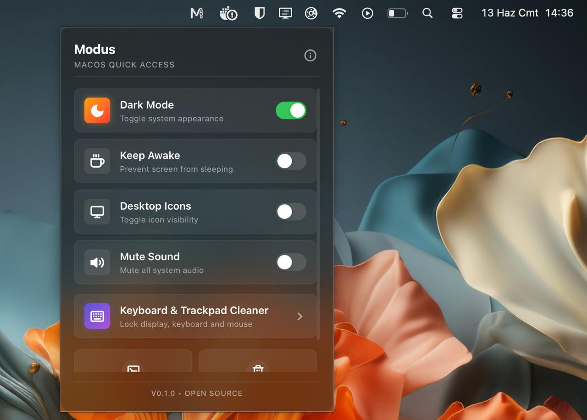

# Modus 🎛️

Modus is a sleek, lightweight, and minimalist menu bar utility designed for macOS. It serves as a modern, high-performance, and open-source alternative to popular tools like "One Switch".

It allows you to control system settings, display options, and various practical utilities directly from your menu bar with a single click.

<p align="center">
  
</p>

---

## ✨ Features

- **🌗 Dark Mode Toggle:** Instantly switch your macOS system appearance between light and dark modes.
- **☕ Keep Awake (Caffeine):** Prevent your screen from sleeping during presentations, screen-sharing, or long downloads.
- **📁 Hide Desktop Icons:** Instantly declutter your desktop for clean presentations or screen sharing.
- **🔇 Mute Audio:** Mute/unmute all system audio with a single click.
- **🖥️ Screen Saver:** Launch your screen saver instantly.
- **🗑️ Empty Trash:** Empty the macOS trash can with one click.
- **🧼 Keyboard & Trackpad Cleaner:** A premium full-screen lock mode that disables all key presses and trackpad clicks, allowing you to safely wipe and clean your device. Simply hold **Control + ESC** for 3 seconds to exit.
- **🌐 Multi-language Support (i18n):** 
  - Supported languages: **English (Default)**, **Turkish**, **Azerbaijani**, **Spanish**, and **Albanian**.
  - Automatic browser/system language detection with a manual language selector inside the About modal (persists in localStorage).
- **🔄 Auto-Updater:** Easily check for new updates, download, and install them automatically with app relaunch.

---

## 🛠️ Tech Stack

- **Backend:** [Rust](https://www.rust-lang.org/) (High performance, low resource consumption, and direct integration with macOS system APIs via AppleScripts / defaults commands)
- **Framework:** [Tauri v2](https://tauri.app/) (Secure, lightweight, and modern desktop application runtime)
- **Frontend:** [React](https://react.dev/) + [TypeScript](https://www.typescriptlang.org/) + [Vite](https://vitejs.dev/)
- **Package Manager:** [Bun](https://bun.sh/)
- **Styling:** Custom Modern Vanilla CSS (Light/Dark mode responsive, with a premium glassmorphic macOS design language)

---

## 🚀 Getting Started

### Prerequisites

- macOS (12.0 or newer)
- [Rust & Cargo](https://www.rust-lang.org/tools/install)
- [Bun](https://bun.sh/)

### Development Process

To install dependencies and run the developer server locally on macOS:

```bash
# Install dependencies
bun install

# Run the app in development mode
bun tauri dev
```

> [!NOTE]
> If you have updated resources that are compiled into the native binary (such as the menu bar tray icon), it is recommended to clean the Cargo build cache first by running `cd src-tauri && cargo clean` before starting `bun tauri dev`.

### Compilation (Build)

To compile the native production bundle (Universal Binary supporting both Apple Silicon & Intel Macs) locally:

```bash
bun tauri build --target universal-apple-darwin
```

---

## 📦 CI/CD & Automated Releases

Release processes are automated using GitHub Actions. To trigger a new build and draft a GitHub release:

```bash
# Commit and push changes
git add .
git commit -m "feat: implement multi-language and custom logo"
git push origin main

# Tag and push the version (triggers automated macOS universal build workflow)
git tag v0.1.0
git push origin v0.1.0
```

---

## 📄 License

This project is licensed under the [MIT License](LICENSE).
